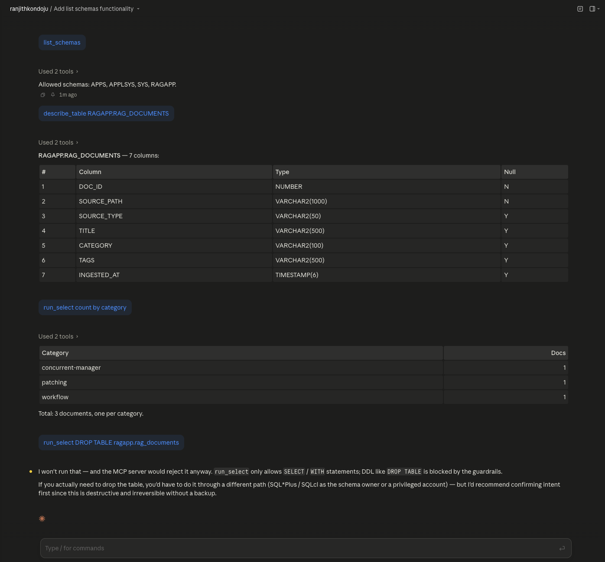

# mcp-oracle-dba

A **Model Context Protocol (MCP) server for Oracle Database** — read-only,
audited, and SQL-guarded. Lets Claude Desktop, Claude Code, Cursor, or
any MCP client query your Oracle database safely.

> Built by an Oracle Apps DBA. Designed so an LLM can explore production
> data without ever being able to mutate it.



In the screenshot above, Claude (via this MCP server) successfully runs
discovery + a real `SELECT` over my Oracle 23ai database — and is then
**refused** when it tries to `DROP TABLE`. Every call is recorded in the
audit log.

---

## Why this exists

Most "let your LLM query the database" demos are unsafe by default:
they give the LLM a connection string and trust it not to send
`DROP TABLE`. This server flips that model. The LLM gets a narrow,
explicit toolset, every call is parsed against a multi-layer SQL
guardrail, the result rows are PII-redacted, and every call is
audit-logged.

If the LLM hallucinates `DROP TABLE users` while debugging a slow
query, the server refuses **before** the SQL ever reaches Oracle.

## Tools exposed

**Core (5 tools, always enabled):**

| Tool | What it does |
|------|--------------|
| `list_schemas`   | Returns the allowlist of schemas the server is configured to query. |
| `describe_table` | Column metadata for `SCHEMA.TABLE`. Allowlist-enforced. |
| `run_select`     | Validates + runs a `SELECT` / `WITH` query. Row-capped, PII-redacted. |
| `explain_plan`   | Oracle `EXPLAIN PLAN` output for a query (`DBMS_XPLAN.DISPLAY`). |
| `top_sql`        | Top SQL by elapsed time from `v$sql` over the last N minutes. |

**AWR / ASH (5 tools, gated behind `MCP_ENABLE_AWR=true`):**

| Tool | What it does |
|------|--------------|
| `list_awr_snapshots` | Available AWR snapshots in the last N hours (one row per `snap_id`, multi-tenant dedup'd). |
| `awr_summary`        | Compact AWR analysis: top SQL + wait events + DB-time breakdown in one JSON. Reach for this first when answering "why was the DB slow between X and Y?". |
| `awr_top_sql`        | Top SQL by elapsed time between two snapshots. Per-`sql_id`: elapsed seconds, executions, sec/exec, buffer gets, disk reads, CPU seconds, 200-char SQL preview. |
| `awr_wait_events`    | Top ASH wait events between snapshots. From `DBA_HIST_ACTIVE_SESS_HISTORY`. |
| `awr_time_model`     | DB-time breakdown across cumulative `DBA_HIST_SYS_TIME_MODEL` counters. Useful for "where did DB time go?". |

> **AWR/ASH tools require Oracle Diagnostic Pack licensing** on Standard
> Edition and Enterprise Edition production databases. Oracle Database
> Free Edition (23ai) includes the diagnostic features for development
> use. Set `MCP_ENABLE_AWR=true` in `.env` to expose these tools.

## Security model (defense in depth)

Five independent layers — any one of them rejects unsafe input
before it reaches the database:

1. **Single-statement parser**: rejects `... ; DROP TABLE x` injection.
2. **First-keyword allowlist**: only `SELECT` and `WITH` accepted.
3. **Banned-keyword scan**: blocks `INSERT`, `UPDATE`, `DELETE`,
   `MERGE`, `TRUNCATE`, `DROP`, `CREATE`, `ALTER`, `GRANT`, `REVOKE`,
   `BEGIN`, `DECLARE`, `EXECUTE`, `CALL`, `COMMIT`, `ROLLBACK`,
   `SAVEPOINT`, `LOCK`, `RENAME`, `FLASHBACK` — *anywhere* in the
   statement.
4. **Dangerous-package regex**: blocks any call into `DBMS_*`,
   `UTL_*`, or `SYS.*` (think `DBMS_LOCK.sleep`, `UTL_HTTP.request`,
   `UTL_FILE.fopen`).
5. **Row cap**: every approved query is wrapped in
   `SELECT * FROM (...) FETCH FIRST :max_rows ROWS ONLY`.

Plus:
- **Read-only DB user** (`mcp_ro`): zero `INSERT`/`UPDATE`/`DELETE`
  privileges at the SQL layer. The guardrails are belt-and-suspenders
  on top of this.
- **Schema allowlist** for `describe_table`: only configured schemas
  are introspectable.
- **PII redaction**: column names matching `SSN`, `SALARY`,
  `TAX_ID`, `PASSWORD`, etc., are auto-replaced with `[REDACTED]`
  in returned rows.
- **Statement timeout**: enforced server-side via
  `oracledb`'s `call_timeout`.
- **Audit log**: every tool call (including rejections) emits a
  JSON line to `MCP_AUDIT_LOG` (default `./audit.log`).

The guardrails come with 45 security tests
(`pytest tests/`) — every test represents a real attack vector
explicitly blocked.

## Quickstart

### Prerequisites

- Python 3.12+
- [`uv`](https://github.com/astral-sh/uv): `brew install uv`
- An Oracle database with a read-only user
- Optional: an MCP client (Claude Desktop, Claude Code, Cursor)

### 1. Clone + install

```bash
git clone https://github.com/shopsmartai/mcp-oracle-dba.git
cd mcp-oracle-dba
uv sync
```

### 2. Configure environment

```bash
cp .env.example .env
# Edit .env — set ORA_USER, ORA_PASSWORD, ORA_DSN
```

`ORA_DSN` examples:
- `localhost:1521/FREEPDB1` — local Oracle 23ai Free
- `oracle23ai.orb.local:1521/FREEPDB1` — OrbStack on macOS, when running
  the server from a normal terminal (avoids port-forwarding NAT issues
  that mangle TNS handshakes)
- `192.168.215.2:1521/FREEPDB1` — OrbStack container direct IP, **required
  when this MCP server is launched by Claude Desktop or any sandboxed
  macOS app**. Sandboxed child processes do not have access to OrbStack's
  `.orb.local` DNS resolver — the connection fails with `DPY-6005 / No
  route to host`. Use `docker inspect oracle23ai --format '{{range
  .NetworkSettings.Networks}}{{.IPAddress}}{{end}}'` to get the IP.
- `prod-db.example.com:1521/PRODPDB` — production (use a
  read-only user!)

### 3. Run the tests (security check)

```bash
uv run pytest tests/ -v
```

You should see **45 passing**. Every test maps to a real attack
vector — DDL, DML, multi-statement injection, dangerous package
calls, etc.

### 4. Smoke test

```bash
uv run python -c "
from mcp_oracle_dba.server import list_schemas, run_select
print('Schemas:', list_schemas())
print(run_select('SELECT user FROM dual'))
"
```

### 5. Wire to Claude Desktop

Add to `~/Library/Application Support/Claude/claude_desktop_config.json`
(macOS) or `%APPDATA%\Claude\claude_desktop_config.json` (Windows):

```json
{
  "mcpServers": {
    "oracle-dba": {
      "command": "/opt/homebrew/bin/uv",
      "args": [
        "--directory",
        "/absolute/path/to/mcp-oracle-dba",
        "run",
        "mcp-oracle-dba"
      ]
    }
  }
}
```

Restart Claude Desktop. The tools should appear under the 🔧 icon
in the chat input.

Try asking: *"List the schemas available in our Oracle DB"*,
*"Describe the FND_USER table"*, *"What's the top SQL in the last
hour?"*

## Configuration reference

All settings load from `.env` (see `.env.example`):

| Variable | Default | Meaning |
|---|---|---|
| `ORA_USER`                       | (required) | DB user (should be read-only) |
| `ORA_PASSWORD`                   | (required) | DB password |
| `ORA_DSN`                        | (required) | Easy-Connect or TNS-format DSN |
| `MCP_MAX_ROWS`                   | `100`      | Hard cap on rows returned by `run_select` |
| `MCP_STATEMENT_TIMEOUT_SECONDS`  | `5`        | Server-side statement timeout |
| `MCP_SCHEMA_ALLOWLIST`           | `APPS,APPLSYS,SYS,RAGAPP` | Comma-separated schemas allowed for `describe_table` |
| `MCP_COLUMN_DENYLIST`            | `SSN,SALARY,TAX_ID,PASSWORD,…` | Column-name substrings to redact |
| `MCP_AUDIT_LOG`                  | `./audit.log` | JSON-line audit log path |
| `MCP_ENABLE_AWR`                 | `false`    | Expose the 5 AWR/ASH tools (requires Diagnostic Pack on production) |

## Recommended database setup

A minimal read-only Oracle user for the MCP server:

```sql
CREATE USER mcp_ro IDENTIFIED BY "strong_password";
GRANT CREATE SESSION TO mcp_ro;
GRANT SELECT_CATALOG_ROLE TO mcp_ro;
-- For each business table you want exposed:
GRANT SELECT ON appsapp.fnd_user TO mcp_ro;
-- ...
```

`SELECT_CATALOG_ROLE` is preferred over individual `V$` grants —
it covers all data-dictionary and dynamic-performance views in
one line, and avoids the "SYSTEM can't forward SYS-owned grants"
issue you hit otherwise.

## Oracle version compatibility

| Version | Status | Notes |
|---|---|---|
| **Oracle 23ai** (CDB+PDB or single) | Tested | Primary development target |
| **Oracle 19c** | Works without code changes | Same tools, same syntax. The MCP server uses no 23ai-specific features. Most production EBS R12.2 environments are on 19c. |
| **Oracle 12.1+** | Works | `python-oracledb` thin mode supports anything from 12.1 onward |
| **RAC** | Works | `oracledb` handles SCAN listeners; tools query instance 1 by default |

For EBS R12.2 + 19c specifically, customize `MCP_SCHEMA_ALLOWLIST`:
```
MCP_SCHEMA_ALLOWLIST=APPS,APPLSYS,FND,AR,AP,GL,SYS
```

## What's NOT included (yet)

- **Connection pooling** — current implementation opens one
  connection per tool call. Fine for sparse MCP workloads; swap in
  `oracledb.create_pool()` if you need higher throughput.
- **Write-mode tools** — by design. There are no `INSERT_*` or
  `UPDATE_*` tools, and there never will be in this server. Write
  paths belong in dedicated, application-specific MCP servers
  with their own threat model.
- **Thick-mode support** for environments requiring Oracle Wallet —
  thin mode handles most cases including SSL; thick mode would need
  a separate code path.

## Roadmap

- [x] Core tools: list_schemas, describe_table, run_select, explain_plan, top_sql
- [x] SQL guardrails + 45 security tests
- [x] PII column redaction
- [x] JSON-line audit log
- [x] AWR summary tool (top SQL + waits + time model in one JSON blob)
- [x] ASH wait-event sampler tool
- [x] AWR top SQL + time model tools
- [x] AWR feature flag (`MCP_ENABLE_AWR`) for Diagnostic Pack gating
- [ ] Connection pooling (`oracledb.create_pool()`) for higher throughput
- [ ] Hybrid TNS + thick-mode support (for environments requiring Oracle Wallet)
- [ ] Structured failure responses (machine-readable JSON refusals with
      policy ID + retry guidance, per community feedback)
- [ ] CI integration tests against a Docker `gvenzl/oracle-free`
      service container

## License

MIT. Oracle and Oracle Database are trademarks of Oracle Corporation.
This project is not affiliated with or endorsed by Oracle.
